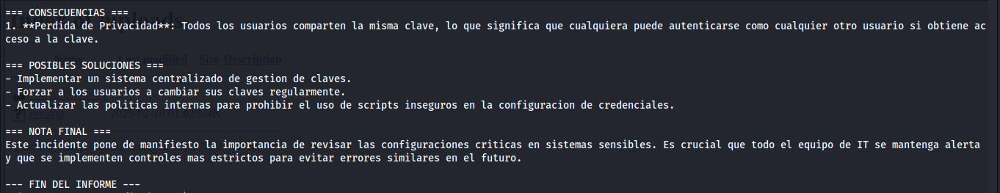
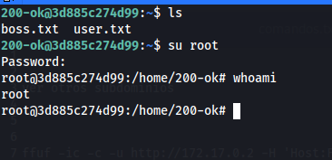
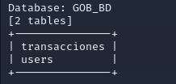
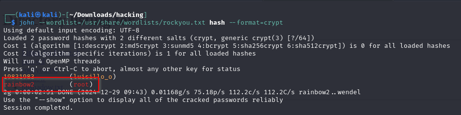
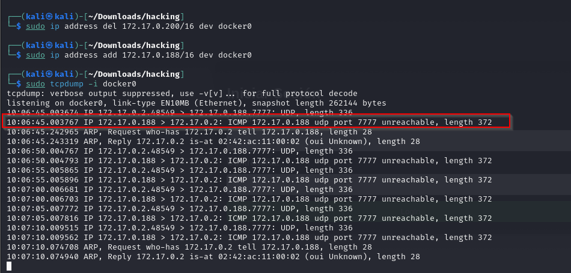

# Maquina apolos

### Puertos abiertos

sudo nmap -sS --min-rate 6000 -p- --open -vvv -Pn 172.17.0.2

### Servicios y versiones

sudo nmap -sVC --min-rate 6000 -p22 -vvv -Pn 172.17.0.2

### Fuzzing Web

gobuster dir -t 200 -u http://172.17.0.2/ -w /usr/share/wordlists/dirbuster/directory-list-2.3-medium.txt -x php,txt,bak,sh,py,js,html -r -b 403,404 2>/dev/null

Entramos en la web y me creo una cuenta e inicio sesión, luego me voy al panel de mi carrito y me encuentro con un intup de búsqueda, aplico unos comandos de inyección sql y funcionan.

Entonces intrcepto la petición de búsqueda de un producto con burpsuite, la guardo como archivo llamado search, para luego utilizar sqlmap.

ejecuto:

sqlmap -r search --dbs --batch --dump

me interesa el usuario admin, desencripto la password con crackstation.

ahora iniciamos sesión con las credenciales encontradas.

Iniciada la sesión nos dirigimos a la sección de administración, luego en configuración.

luego hay una secció para subir un archivo, el archivo que podemos subir debe ser extensión phtml

### Intrusión

creamos una reverse shell en php con extensión phtml, nos ponemos en escucha con netcat, la subimos nos dirigimos a uploads le damos clic en el archivo.

Una vez iniciada la sesión hacemos tratamiento de la tty.

Luego me dirijí a home y me doy cuenta que existe un usuario llamado luisillo_o

lo que hice fue usar la herramienta Sudo_BruteForce -> https://github.com/Maalfer/Sudo_BruteForce, la descargué en mi kali y la pasé a la máquina victima creando un servidor web con python y descargandola en la máquina víctima con wget, de igual manera pasé el rockyou.

Ejecución de la herramienta:

### Escalar privilegios

cambiamos al usuario luisillo_o

el usuario luisillo_o tiene permiso de lectura del archivo shadow, entonces hice

luego ejecuté en mi kali:

unshadow passwd shadow > hash

