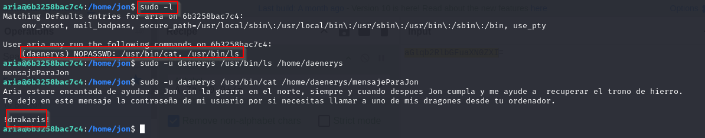

# Máquina cachopo

### Puertos abiertos

sudo nmap -sS --min-rate 6000 -p- --open -vvv -Pn 172.17.0.2

### Servicios y versiones

sudo nmap -sVC --min-rate 6000 -p22,80 -vvv -Pn 172.17.0.2

### Entrando a la web

Encontré un formulario

Lo que se me ocurrió fue interceptarlo con burpsuite al formulario.

al interceptarlo lo mandé al repeater y me aparece el mensaje de error de la derecha, lo que significa que interpreta texto en base64.

le mandé el código de arriba:

y efectivamente lee base64, entonces hice:

para ver los usuarios:

### Intrusión
Como ya tenía el usuario cachopin, lo que hice fue hacer fuerza bruta con hydra al servicio ssh:

hydra -l cachopin -P /usr/share/wordlists/rockyou.txt ssh://172.17.0.2 -t 64 -I

Ingresamos por ssh con las credenciales encontradas:

### Escalar privilegios:

En /home/cachopin/app/com/personal encontré hashes de SHA1, entonces utilicé la herramienta:

https://github.com/PatxaSec/SHA_Decrypt

hice su root y ingresé la contraseña cecina:

