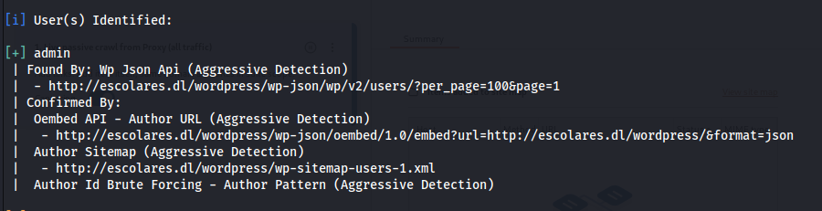

# Maquina Pingpong

### Puertos abiertos

sudo nmap -sS --min-rate 6000 -p- --open -vvv -Pn 172.17.0.2

### Servicios y versiones

sudo nmap -sVC --min-rate 6000 -p80,443,5000 -vvv -Pn 172.17.0.2

### Fuzzing Web

gobuster dir -t 200 -u http://172.17.0.2/ -w /usr/share/wordlists/dirbuster/directory-list-2.3-medium.txt -x php,txt,bak,sh,py,js,html -r -b 403,404 2>/dev/null

no encontré nada

fuzzing al 443 y no encontré nada.

Entré al puerto 5000:

probé con ejecución remota de comandos:

entonces envíe una reverse shell:

tratamiento de la TTY

siendo el usuario bobby y al querer cambiar al usuario gladys se me congelaba la conexión entonces me envié una reverse shell.

### Escalar privilegios

