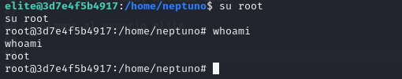

# Máquina Whoiam

### Puertos abiertos

sudo nmap -sS --min-rate 6000 -p- --open -vvv -Pn 172.18.0.2

### Servicios y versiones

sudo nmap -sVC --min-rate 6000 -p80 -vvv -Pn 172.18.0.2

### Fuzzing Web

gobuster dir -t 200 -u http://172.18.0.1/ -w /usr/share/wordlists/dirbuster/directory-list-2.3-medium.txt -x php,txt,bak,sh,py,js,html -r -b 403,404 2>/dev/null

### Entramos en /backups

descargamos el archivo .zip

lo descomprimimos y vemos el contenido:

### Intrusión

Iniciamos sesión con las credenciales encontradas:

luego creamos un rev.php y lo comprimimos con zip

código rev.php:

nos ponemos en escucha con netcat en el puerto 443

subimos el plugin y luego lo instalamos y activamos y listo tenemos acceso:

hacemos tratamiento de la tty

ahora tenemos que cambiar a diferentes usuarios:

rafa, ruben

### Escalar privilegios

Siendo el usuario ruben

